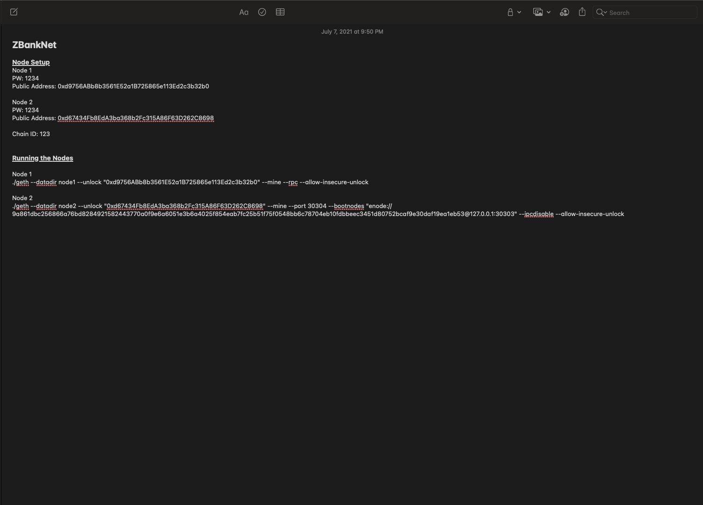
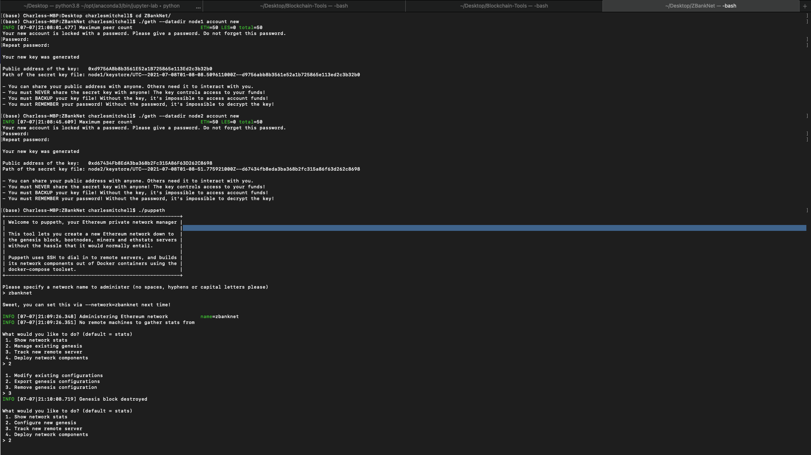
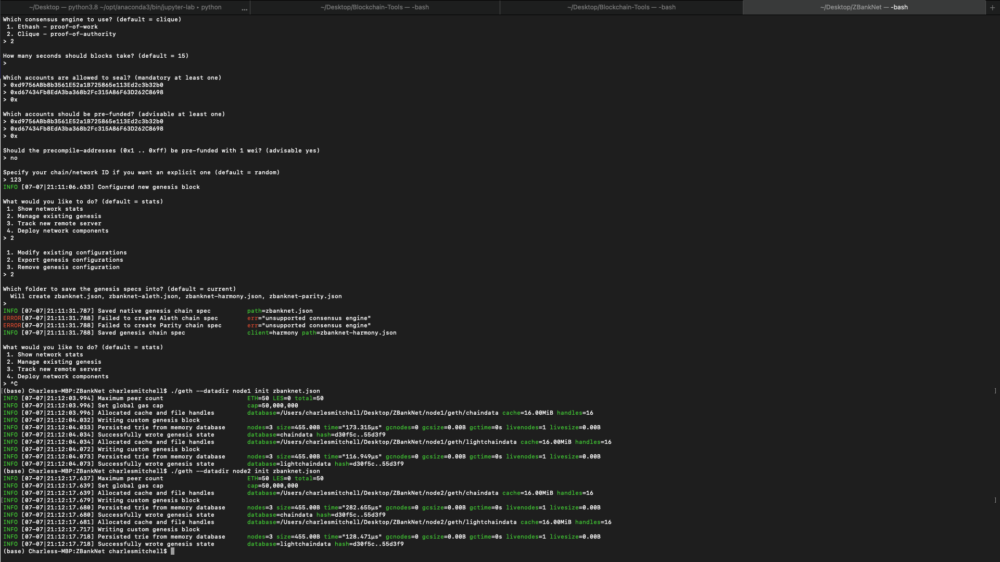

# ZBankNet

### Overview
In this repository we will be creating a private Blockchain run on a Proof-of-Authority consensus algorithm for ZBank, a small, innovative bank. As the main developers of the blockchain, it is imperative that it runs successfully and that we leave the correct guide for others to build on it afterwards. 

The picture above should serve as a guide for accessing the blockchain, as well as the testnet network.

---

### Node Creation & Initialization
We began the process by creating two nodes (node1 & node2) because these are the two nodes that will have access to the blockchain, mine the blockchain, and keep a record of all transactions all simultaneously. In the first picture below, node1 and node2 are being created and given publick keys - which are both provided at the top of this page.

Following the setup, we configured the two nodes to both be pre-funded (since there will be no mining reward) and allowed access to the blockchain to mine. Once both nodes were set up, we proceeded to initialize them each which officially adds them to our ZBank blockchain. You can see that both initializations were successful in the image below.

---

### Mining Environment Setup

